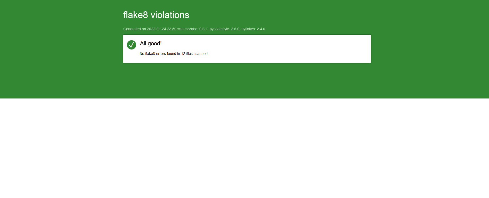

# p4-echec

## Installation.

Pour utiliser l'application,   
il est conseillé sous le prompt bash python (ici cmd Anaconda3 sous Windows 10):  

1. de cloner l'ensemble du répertoire github dans un répertoire local dédié.  
        ``` https://github.com/chrisopenclass/p4-echec
2. se déplacer dans le sous répertoire de travail
        ``` cd p4-echec
3. de créer un environnement virtuel python, env  
        ``` python -m venv env  
4. d'activer un environnement virtuel python, env  
        ``` env\scripts\activate.bat  
5. d'installer les paquets requis pour mémoire,   
        ``` pip install -r requirements.txt  
6. d'executer le script  
        ``` python main.py  

Nous avons tenté de suivre les principes de la programmation orientée objet et de respecter l'architecture MVC en séparant le code en 3 parties :   
* Models pour les données,  
* Views pour l'interaction avec l'utilisateur et  
* Controllers pour la logique.  
  
La conformité aux recommendations de style de la PEP8 a été validée par le paquet flake8 en version 4.0.1.  

  
Pour produire votre propre rapport flake8, procédez ainsi :
dans votre environnement virtuel sous le prompt bash python :  
1. executer le script  
        ``` flake8 --format=html --htmldir=flake8_report  
  
Pour respecter certaines demandes du cahier des charges, le fichier de configuration ".flake8" a été adapté :  
```
[flake8]
max-line-length = 119
max-function-length=50
doctests = True
# no time yet to divide __init__ or create a factory fonction
extend-ignore = CFQ002 
```  
